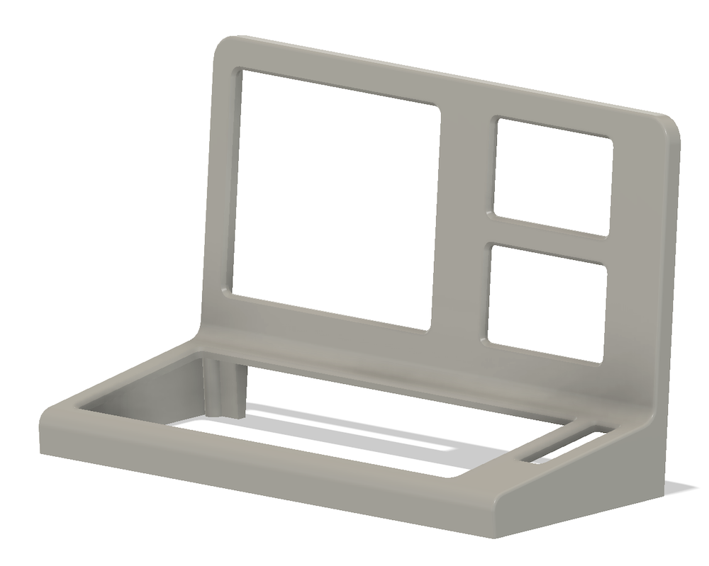

# TRS-80 Model III Raspberry Pi 5 Computer Build

Earlier this year I completed a classic Macintosh Raspberry Pi 5 computer.  I had a lot of fun designing and building this.

If you would like to check out that project, here it is: https://github.com/ryanmfransen/macpi

I fell in love with that machine. It sat on my desk and I used it daily as my main desktop workstation. I really liked how it turned out and how useful it was.

After using the classic mac for a while, I started thinking about what my next project would be. Being a retro computer nerd, and selling off my collection of TRS-80's a year ago, and scratching the Macintosh itch, I was starting to feel the urge to reclaim some of that Radio Shack vibe I no longer had.

The TRS-80 Model III Raspberry Pi 5 project was born.

## Goals

I had the following goals in mind:

**Retro Inspired Design**

I wanted to retain as much retro inspiration in the design. While I wasn't aiming for an exact Model III case with all the original features, I wanted someone to look at it and immediately know its parents were TRS-80 Model III's. I wanted to have a keyboard that looked like the original.  I wanted to incorporate something where the two disk drives were, and I wanted to tie in the red reset button and that section somehow.

**All in one**

Clearly I needed a single case design with the built in keyboard, buttons, etc.

**4:3 LCD Display**

While using modern tech (LCD screens) I wanted to retain the original form as much as possible, so a 4:3 display was needed. No modern large wide screens allowed.

**Raspberry Pi 5 Based**

I wanted to make this PC built on the Raspberry Pi 5 with an NVME drive.

**Disk Drives**

While I wanted to retain some of the unique design of the two drives on the right side of the Model III, I didn't know what to do here. Obviously adding disk drives doesn't make sense these days, but I wanted to use something modern to make use of that space.

**Design**

I had to design the entire thing myself. Though I was using off the shelf components, I wanted to design the entire case myself, making this a unique machine.  I enjoy designing and modeling, so this was a must for me.

**3d Printed Case**

In addition to printing the case out for myself, I would like to be able to share the model files so others could also make one of these computer cases if they wanted to. This required me to ensure the design accommodated the ability to 3D print this easily.

**Daily Driver**
I wanted this machine to be on my desk and be my main desktop workstation. I wanted it to be useful and not something I wouldn't ever use sitting on a shelf.

## Case
I designed the case in Fusion 360. It was modeled around the components I had purchased for this, including the keyboard, speakers, RPi, controls, switches, connectors, displays, etc.

I tried to honour the original design of the Model III, and while I did take many liberties, I feel I largely succeeded here.  The case is smaller than a real Model III, perhaps ~55% scale. I don't have my Model III here anymore so I cannot be sure of the exact size.

The case is in three parts - the bottom to hold all the electronics, the front to hold the displays, and the back cover.

My 3d Printer only has a bed of 256mm x 256mm so I had to split the bottom into four pieces to print, and the front and back cover into two pieces. I built in indexes so when I glued the sections together they would align perfectly.

I have a few modifications I would like to do for the next revision, and once that is complete I plan on releaseing the model files for others to print.

Here are a few pictures of the design.

## Displays

There are three displays on the machine. The large main one, and two smaller  MIPI SPI touchscreen displays. I don't know if there is a real practical use for three displays, but I have made great use of them so far, and I couldn't think of anything better to use in the location where the original disk drives were.  I've been keeping htop running on one display and a page to a custom Home Assistant dashboard works perfectly on the other touch screen.

## Rapsberry Pi

I used an 8GB Raspberry Pi 5, with an NVME drive. There are plenty of good options available.  I chose to use the Geekworm X1001 PCIe to M.2 HAT. This was a great option to ensure I had enough room for the two display cables connected to the main board.

## Keyboard

I used the MageGee Portable 60% Mechanical Gaming Keyboard, which has an amazing feel.  I chose this one because of the size, the layout and I wanted to mimic the original TRS-80 keyboard colour scheme, and this was as close as I could reasonably get. I think it worked out quite well.

## Power Button

The power button is connected to theRaspberry Pi 5 power connector.  While there are no headers soldered on the board, it was easy to add the header pins so I was able to connect the button. This works great, and I used a switch with a red LED in it connected to the GPIO for power status.

## Parts

Here is a breakdown of all the parts I used

|Part|Cost|Link|
|:------|:------|:------|
|Keyboard|  $49.99| https://www.amazon.ca/gp/product/B0BVW1S6SN
|Mouse| $15.99| https://www.amazon.ca/dp/B0C8MQJN7K
|Power Cable| $10.37| https://www.amazon.ca/Amazon-Basics-Computer-Monitor-Replacement/dp/B072BYGKZZ
|Power Button|  $0.59|  https://www.aliexpress.com/item/1005004959764864.html
|Power Receptacle|  $7.50|  https://www.amazon.ca/gp/product/B0895T9NXF
|Ethernet Cable|  $4.14|  https://www.aliexpress.com/item/1005001647869476.html
|USB Cable| $11.34| https://www.aliexpress.com/item/4000032070517.html
|Display (Large)| $53.99| https://www.aliexpress.com/item/1005004453277307.html
|Display (Small)| $127.82|  https://www.amazon.ca/gp/product/B0C65YH5R4
|SPI Display Cable| $22.64| https://www.amazon.ca/dp/B0D12SLW63
|HDMI Cable|  $12.99| https://www.amazon.ca/gp/product/B09J4HGMYR
|Audio Cable| $3.12|  https://www.aliexpress.com/item/32826276081.html
|Power Supply|  $17.87| https://www.amazon.ca/gp/product/B07RQ534SP
|USB Audio Device|  $17.99| https://www.amazon.ca/gp/product/B01N905VOY
|Audio Amplifier| $10.70| https://www.amazon.ca/gp/product/B07F8K374S
|Raspberry Pi 5|  $110.95|  https://www.pishop.ca/product/raspberry-pi-5-8gb/
|Raspberry Pi 5 Active Cooler|  $7.00|  https://www.pishop.ca/product/raspberry-pi-active-cooler/
|Raspberry Pi 5 NVME Hat| $23.99| https://www.amazon.ca/gp/product/B0CPPGGDQT
|Raspberry Pi 5 M.2 NVME Drive| $28.99| https://www.amazon.ca/gp/product/B08GJDJ51J
|Speakers|  $7.50|  https://www.amazon.ca/gp/product/B08YWYZDQW
|3D Printer Filament| $25.99| https://ca.store.bambulab.com/collections/petg/products/petg-hf?variant=46336540999920
|Paint, Primer| $30.00|
|Total| $601.45|

## Image Gallery

 
 

 

